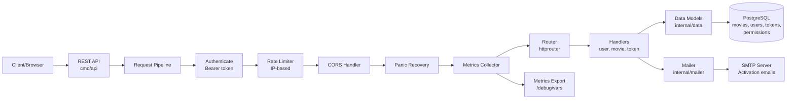
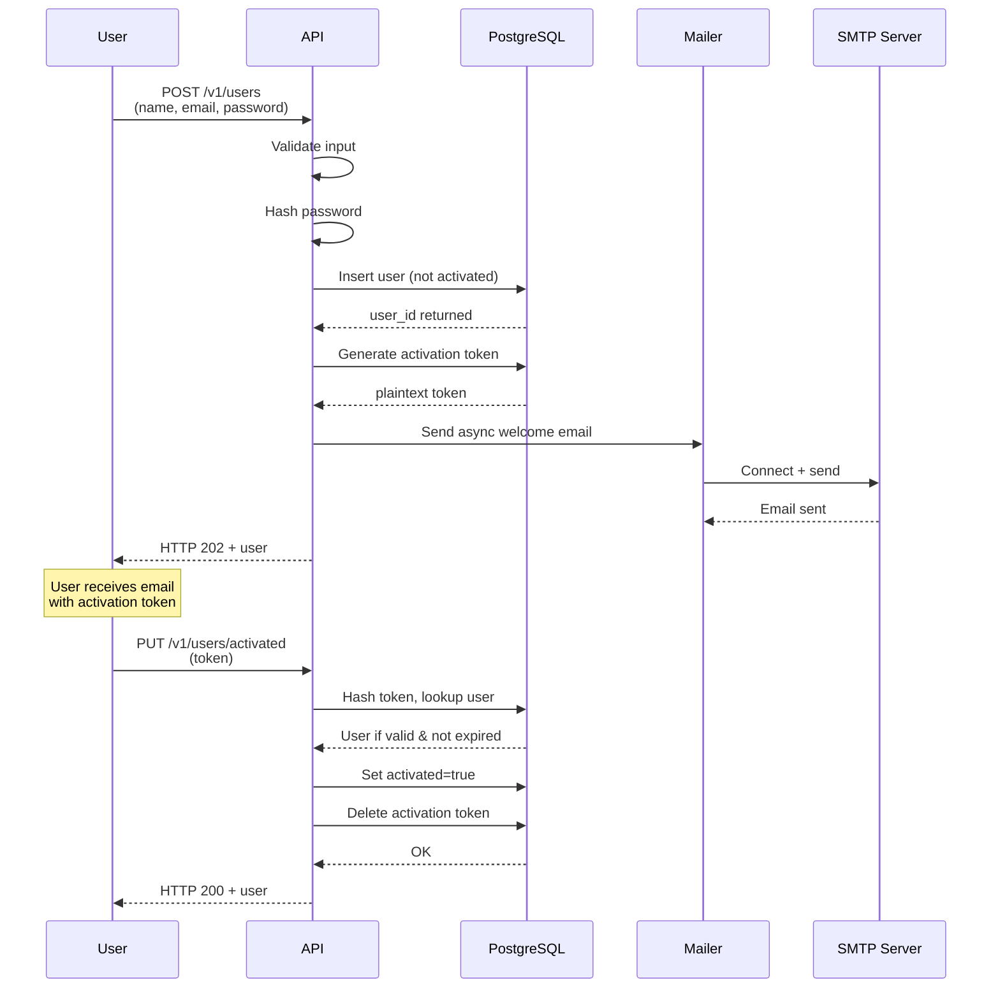
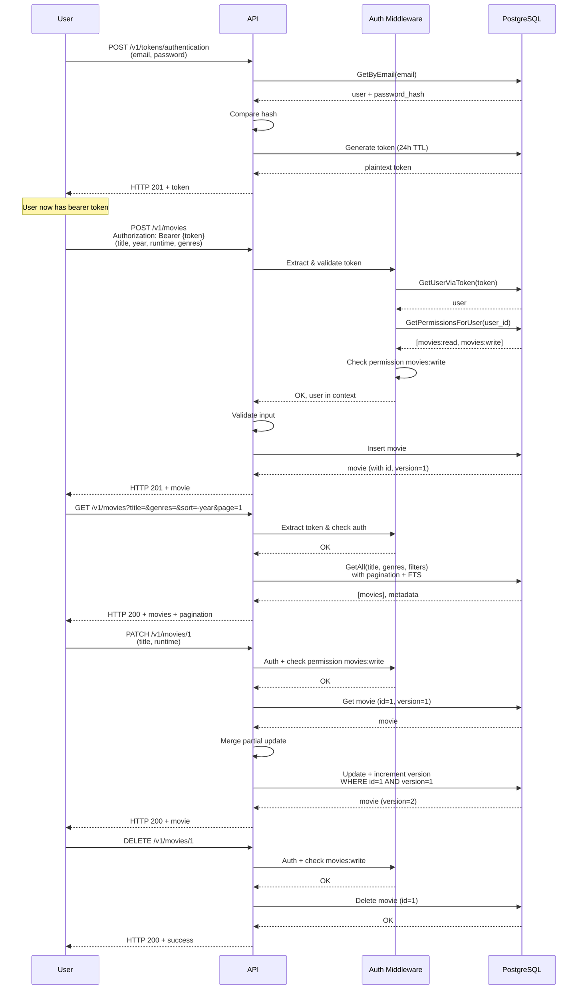

# Greenlight

Greenlight is a Go and PostgreSQL REST API I built as a learning project while practicing the patterns from Let's Go Further. The goal was to learn how a production-style API fits together end to end: request handling, JSON encoding and decoding, validation, persistence, authentication, authorization, email, observability, and graceful shutdown.

The request pipeline wraps the router with metrics, panic recovery, CORS, rate limiting, and authentication middleware before the handlers run.

## What I learned while building it

- How to structure a Go API with a clear split between the `cmd/api` entrypoint and reusable `internal` packages.
- How to return consistent JSON envelopes for success and error responses.
- How to decode request bodies safely, reject malformed input, and validate payloads before they reach the database.
- How to use custom JSON marshaling and unmarshaling for domain-specific values like runtime strings.
- How to implement CRUD for a movie resource with partial updates and optimistic concurrency control.
- How to add filtering, sorting, pagination, and full-text search on top of PostgreSQL.
- How to build user registration, activation tokens, bearer-token authentication, and permission-based authorization.
- How to send activation emails in the background with embedded HTML and text templates.
- How to add rate limiting, CORS handling, request metrics, and graceful shutdown around the API.
- How to keep the project reproducible with migrations, vendored dependencies, Makefile targets, and build version metadata.

---

## System Architecture



---

## End-to-End Flows

### User Registration & Activation



### Movie CRUD with Permission Checks



---

## Why I Built This

I wanted to move beyond toy examples and learn how a production-style API actually handles real concerns:

- **Concurrency & race conditions** – Multiple requests mutating the same resource. How do you prevent lost updates without serializing everything?
- **Request validation pipeline** – Malformed input should fail fast before hitting the database, with precise error messages.
- **Authentication vs authorization** – Tokens tell you who the user is; permissions tell you what they can do. They are not the same thing.
- **Asynchronous operations** – Sending emails in the background without blocking the HTTP response. How do you keep the system reliable when that task fails?
- **Graceful shutdown** – In-flight requests and background tasks need coordination, not a hard kill.
- **Observability** – Metrics, logging, and request tracing so you know what's happening when things go wrong.

The goal was not to ship a product. It was to understand the decisions that matter in a production system and why each one exists.

---

## Engineering Decisions

| Problem | Decision | Why It Matters |
| --- | --- | --- |
| Concurrent updates to the same movie | Optimistic concurrency control (version column + WHERE version = expected) | Fast reads, explicit conflict detection, no locks. |
| All requests from the same IP get unlimited access | IP-based rate limiting with per-client token buckets | Realistic defense; global limits starve legitimate users. |
| Authenticated users can do anything | Permission-based authorization (role codes in a junction table) | Separates authentication (you are who you claim) from authorization (you can do X). Scales better than hardcoded checks. |
| Sending emails blocks the HTTP response | Async email in background goroutines with sync.WaitGroup | User gets response instantly. Email failures do not cascade to the API. Graceful shutdown waits for all emails to send. |
| No way to distinguish activation tokens from auth tokens | Token scopes (activation vs authentication) + separate queries | Same schema, different semantics. Reusable token infrastructure. |
| Runtime values come back as raw integers | Custom JSON marshaling for Runtime type | API contract: runtime is `"120 mins"`, not `120`. Type safety. |
| Database queries can hang indefinitely | Context timeouts on every query (3s default) | Predictable failure mode. Server doesn't accumulate stuck goroutines. |
| No way to tell what the API is doing | Metrics via expvar (/debug/vars): request count, response times, active goroutines, DB pool stats | Production visibility without an external APM. |
| Shutdown while emails are still sending | WaitGroup coordination in the serve() function | In-flight work completes before the process exits. |

---

## Tech Stack

- **Go 1.25** – Lightweight, concurrent, simple deployment (single binary).
- **PostgreSQL** – Relational schema with GIN indexes for full-text search, citext for case-insensitive email, array types for genres.
- **lib/pq** – Database/sql driver; no ORM overhead.
- **httprouter** – Lightweight radix tree router; deliberate alternative to frameworks.
- **crypto/bcrypt** – Password hashing with configurable cost.
- **go-mail** – SMTP client with retry support.
- **Standard library** – `encoding/json`, `context`, `sync`, `time`, `log/slog` for everything else.
- **Migrations** – `migrate` CLI for repeatable schema management.
- **Makefile** – Reproducible build and dev workflow.

---

## Project layout

| Path                 | Purpose                                                                                      |
| -------------------- | -------------------------------------------------------------------------------------------- |
| `cmd/api`            | Application entrypoint, HTTP server setup, handlers, middleware, and route registration      |
| `internal/data`      | Domain models, SQL access, filters, permissions, validation helpers, and custom runtime type |
| `internal/mailer`    | SMTP client and embedded email templates                                                     |
| `internal/validator` | Small reusable validation helper package                                                     |
| `internal/vcs`       | Build version helper used by the API and healthcheck                                         |
| `migrations`         | PostgreSQL schema, constraints, indexes, and seed data                                       |
| `examples/cors`      | Tiny browser demos that show simple and preflight CORS requests                              |
| `vendor`             | Vendored third-party dependencies                                                            |

## Database schema

- `movies` stores the catalog data with `title`, `year`, `runtime`, `genres`, and a `version` column for optimistic locking.
- `movies` also has check constraints for runtime, year, and genre count, plus GIN indexes for full-text title search and genre filtering.
- `users` stores account data with a case-insensitive email column, password hash, activation flag, and version.
- `tokens` stores hashed activation and authentication tokens with an expiry time and a scope.
- `permissions` and `users_permissions` implement permission-based authorization for movie read and write access.

## API endpoints

All movie routes are protected by bearer authentication and permission checks. New users are granted `movies:read` by default after registration.

- `GET /v1/healthcheck` returns status, environment, and build version.
- `GET /v1/movies` lists movies with filtering, sorting, pagination, and search.
- `POST /v1/movies` creates a new movie.
- `GET /v1/movies/:id` fetches a movie by id.
- `PATCH /v1/movies/:id` updates a movie partially.
- `DELETE /v1/movies/:id` deletes a movie.
- `POST /v1/users` registers a new user and sends an activation email.
- `PUT /v1/users/activated` activates a user with a token from email.
- `POST /v1/tokens/authentication` exchanges email and password for a bearer token.
- `GET /debug/vars` exposes runtime and application metrics via expvar.

## Running locally

Prerequisites:

- Go 1.25.2
- PostgreSQL
- The `migrate` CLI
- An SMTP server or Mailtrap account for welcome emails

Typical workflow:

```bash
export GREENLIGHT_DB_DSN='postgres://...'
make db/migrations/up
make run/api
```

Useful Makefile targets:

- `make db/migrations/new name=your_migration_name`
- `make tidy`
- `make audit`
- `make build/api`

## Configuration

The API is configured with command-line flags:

| Flag group                                                                     | Purpose                                               |
| ------------------------------------------------------------------------------ | ----------------------------------------------------- |
| `-port`                                                                        | API port, default `4000`                              |
| `-env`                                                                         | Runtime environment: development, production, or test |
| `-db-dsn`                                                                      | PostgreSQL connection string                          |
| `-db-max-open-conns`, `-db-max-idle-conns`, `-db-max-idle-time`                | Database pool tuning                                  |
| `-limiter-enabled`, `-limiter-rps`, `-limiter-burst`                           | IP-based rate limiting                                |
| `-smtp-host`, `-smtp-port`, `-smtp-username`, `-smtp-password`, `-smtp-sender` | Email delivery settings                               |
| `-cors-trusted-origins`                                                        | Space-separated list of allowed CORS origins          |
| `-version`                                                                     | Prints the build version and exits                    |

If you use `direnv`, place `GREENLIGHT_DB_DSN` in `.envrc` so the Makefile can pick it up automatically.
